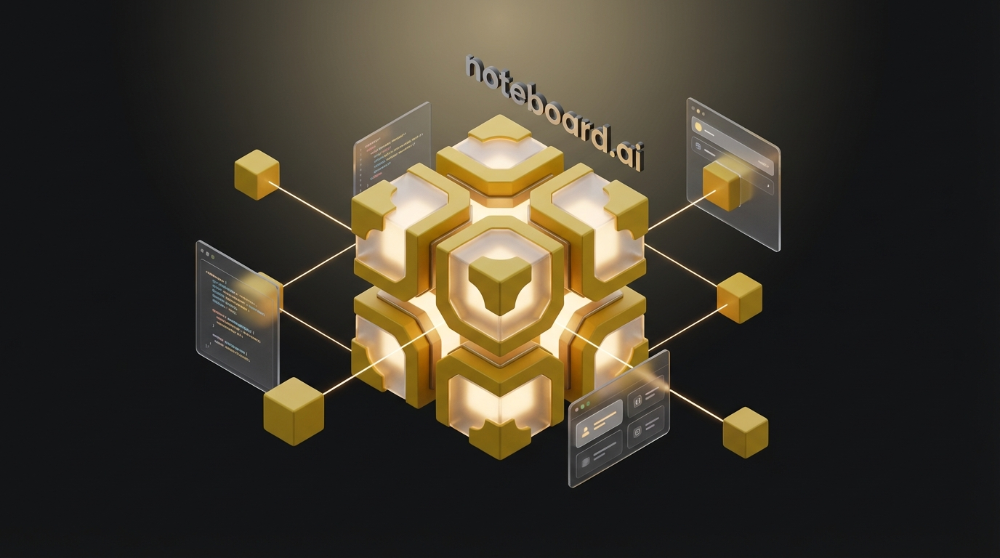
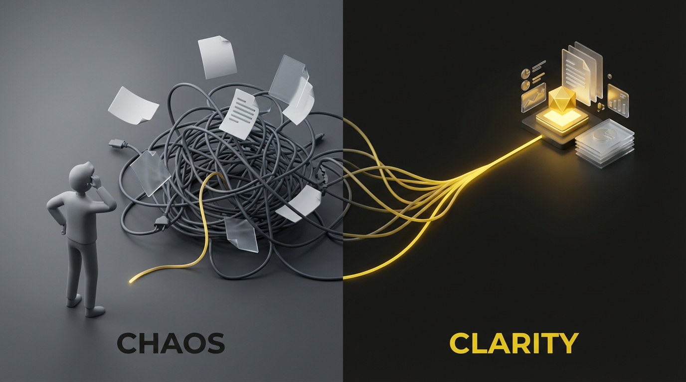
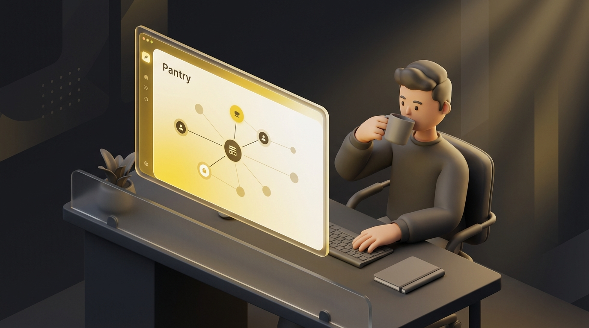
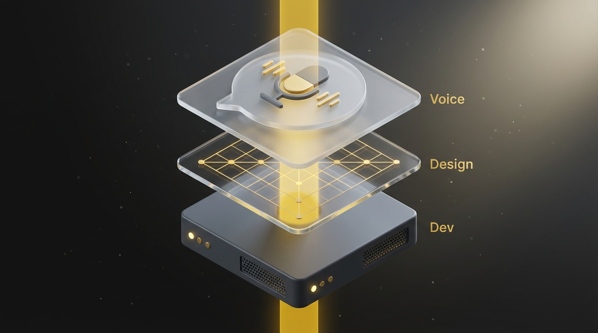
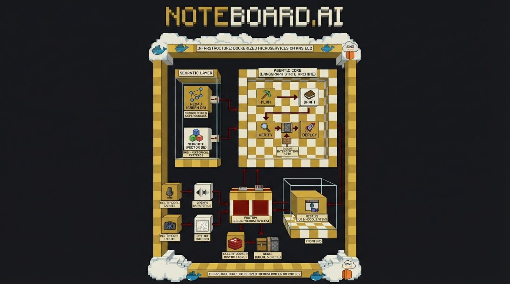

<p align="center">
  
</p>

<h1 align="center">noteboard.ai</h1>

<p align="center">
  <strong>From chaos to clarity — one voice command at a time.</strong><br/>
  An AI-native project management platform that turns spoken requirements into architecture, code, and deployed software.
</p>

<p align="center">
  
  
  
  
  
  
  
  
  
  
</p>

<p align="center">
  
  
  
  
</p>

---

## 🏆 Award Recognition

> **noteboard.ai** was selected as one of the projects for the **Cheng Wu Innovation Challenge** at the **Luddy School of Informatics, Computing, and Engineering** at Indiana University Bloomington. The Cheng Wu Challenge recognizes student-led projects that demonstrate exceptional innovation in computing and technology.

---

## The Problem

<p align="center">
  
</p>

Building software today is fractured. Requirements live in Slack threads, architecture diagrams rot in Confluence, tickets get stale in Jira, and by the time code ships, it no longer matches the original intent. Teams spend more time coordinating than creating.

**noteboard.ai** collapses the entire software delivery lifecycle — from voice requirements to deployed code — into a single, AI-native workflow. No context switching. No stale artifacts. No telephone game between PM, architect, and developer.

---

## The Vision: One Product, One Person

<p align="center">
  
</p>

We believe the future of software engineering is **one person shipping an entire product**. Not because teams don't matter — but because the grunt work between intent and execution should vanish. noteboard.ai acts as your **AI engineering team**:

- **Your PM** lives in the Huddle — speak your requirements naturally and watch them materialize as structured tickets on a knowledge graph.
- **Your Architect** lives in Design — constraints propagate automatically and system diagrams generate themselves.
- **Your Developer** lives in Dev — a LangGraph state machine writes, reviews, and deploys code with human-in-the-loop checkpoints at every critical stage.

The person with the vision should be the person who ships it.

---

## Core Pipeline

<p align="center">
  
</p>

noteboard.ai is built around three core stages that flow naturally into each other:

### 🎙️ Voice — The Huddle

Speak your requirements. The Huddle captures multimodal input (voice via OpenAI Whisper transcription), runs it through an LLM to extract structured intent, and maps it onto a **living knowledge graph** powered by Neo4j. Entities, relationships, and dependencies are extracted automatically — tickets are born from conversation, not manual data entry.

- Real-time voice transcription with browser-native `MediaRecorder`
- AI-powered entity/relationship extraction into Neo4j
- Draft capabilities are editable before confirmation
- Interactive force-graph visualization of your project's knowledge graph

### 🏗️ Design — Auto-Architect

Select a ticket, and the Design stage generates executable **Mermaid.js** high-level and low-level design diagrams. The architecture canvas renders system topology as an interactive React Flow graph — nodes are services, edges are dependencies. Constraints propagate from the knowledge graph so designs stay consistent with requirements.

- One-click HLD/LLD generation from ticket context
- Interactive architecture canvas with `@xyflow/react`
- Constraint-aware diagram generation (dependencies from Neo4j)
- Mermaid.js parsing and rendering pipeline

### ⚡ Dev — The Forge

The Dev stage is a **LangGraph agentic state machine** that writes code autonomously — but never unsupervised. The pipeline flows through strict checkpoints:

```
Plan → [Human Approval] → Draft → [Human Approval] → Verify → Deploy
```

- Real-time WebSocket terminal streaming of agent thoughts and actions
- Redis-backed checkpoint approvals (`waiting_plan` / `waiting_draft`)
- Multi-vendor model selection (OpenAI, Anthropic, DeepSeek, Gemini, Qwen via OpenRouter)
- Markdown build reports saved as artifacts under `backend/artifacts/dev_runs/`

---

## Architecture

<p align="center">
  
</p>

noteboard.ai runs as a **Dockerized microservice stack** orchestrated by `docker-compose`:

| Layer | Technology | Role |
|---|---|---|
| **Frontend** | Next.js 14, Tailwind CSS, Framer Motion | Dashboard, Huddle, Design Canvas, Dev Mission Control |
| **API Gateway** | Caddy 2 | Reverse proxy, automatic HTTPS, routing |
| **Backend API** | FastAPI (Python 3.11+) | REST endpoints, WebSocket manager, auth |
| **Agentic Core** | LangGraph | Plan → Draft → Verify state machine |
| **Semantic Layer** | Neo4j 5.20 (Graph DB) | Knowledge graph — entities, relationships, dependencies |
| **Vector Store** | Weaviate 1.25 | DAG + historical pattern embeddings |
| **Task Queue** | Celery + Redis | Async job processing |
| **Database** | PostgreSQL (Alpine) | Users, projects, tickets, persistent state |
| **Cache / Pub-Sub** | Redis (AOF-enabled) | Checkpoint state, model catalog cache, session data |
| **AI Providers** | OpenAI, OpenRouter | Transcription (Whisper), generation (GPT-4o, Claude, DeepSeek, etc.) |

### Key Design Decisions

- **Human-in-the-loop everywhere.** The agentic pipeline never auto-deploys. Every critical stage requires explicit human approval via Redis checkpoint gates.
- **Graph-first knowledge.** Requirements aren't flat text — they're structured as a knowledge graph with typed relationships (`DEPENDS_ON`, `EXTENDS`, etc.), enabling constraint propagation and impact analysis.
- **Provider-agnostic AI.** A global model selector in the dashboard topbar lets you switch between OpenAI, Anthropic, DeepSeek, Gemini, and more at runtime. The backend routes through a provider-aware abstraction layer.
- **Image-baked deployments.** Backend code is baked into Docker images (no source bind mounts in production), ensuring immutable, reproducible builds.

---

## Quick Start

### Prerequisites

- **Docker** & **Docker Compose** v2+
- An **OpenAI API key** (for transcription and generation)
- Optionally, an **OpenRouter API key** (for multi-vendor model access)

### 1. Clone & Configure

```bash
git clone https://github.com/your-org/noteboard.git
cd noteboard
cp .env.example .env
```

Edit `.env` with your API keys:

```env
OPENAI_API_KEY=sk-...
OPENROUTER_API_KEY=sk-or-...         # Optional
NEXTAUTH_SECRET=your-secret-key
POSTGRES_PASSWORD=your-db-password
NEO4J_PASSWORD=your-neo4j-password
```

### 2. Launch

```bash
docker compose up -d --build
```

This spins up all 8 services (API, Worker, Frontend, Postgres, Redis, Neo4j, Weaviate, Caddy).

### 3. Access

| Service | URL |
|---|---|
| **Dashboard** | `http://localhost:3000` |
| **API Docs** | `http://localhost:8000/docs` |
| **Neo4j Browser** | `http://localhost:7474` (internal) |

### 4. Seed Demo Data (Optional)

```bash
docker exec -it noteboard_api python -m scripts.seed_ecommerce
```

Seeds 16 e-commerce microservice tickets with `DEPENDS_ON` relationships for `demo@noteboard.ai`.

---

## Project Structure

```
noteboard/
├── backend/                    # FastAPI application
│   ├── app/
│   │   ├── api/endpoints/      # REST endpoints (auth, projects, huddle, design, dev, tickets)
│   │   ├── core/               # Config, database, security, logging
│   │   ├── models/             # SQLAlchemy models (User, Project, Ticket)
│   │   ├── schemas/            # Pydantic request/response schemas
│   │   ├── services/           # AI service, knowledge graph, LangGraph agent, Redis
│   │   └── websockets/         # WebSocket connection manager
│   ├── alembic/                # Database migrations
│   ├── scripts/                # Seed scripts
│   └── Dockerfile
├── frontend/                   # Next.js 14 application
│   └── src/
│       ├── app/                # App Router pages (dashboard, huddle, design, dev)
│       ├── components/         # UI components (sidebar, topbar, canvases, graphs)
│       ├── lib/                # API client, utilities, parsers
│       ├── store/              # Zustand stores (project, huddle, activity, model config)
│       └── types/              # TypeScript type definitions
├── nginx/                      # Caddy reverse proxy config
├── docker-compose.yml          # Full stack orchestration
└── .env                        # Environment configuration
```

---

## Tech Stack

<table>
  <tr>
    <th>Category</th>
    <th>Technologies</th>
  </tr>
  <tr>
    <td><strong>Frontend</strong></td>
    <td>Next.js 14 · React 18 · Tailwind CSS · Framer Motion · anime.js · Zustand · @xyflow/react · react-force-graph-2d</td>
  </tr>
  <tr>
    <td><strong>Backend</strong></td>
    <td>FastAPI · SQLAlchemy (async) · Alembic · Celery · Pydantic v2 · Loguru</td>
  </tr>
  <tr>
    <td><strong>AI / ML</strong></td>
    <td>LangGraph · OpenAI API · OpenRouter · Whisper (gpt-4o-transcribe) · GPT-4o</td>
  </tr>
  <tr>
    <td><strong>Databases</strong></td>
    <td>PostgreSQL · Neo4j 5.20 (APOC) · Weaviate 1.25 · Redis (AOF)</td>
  </tr>
  <tr>
    <td><strong>Infrastructure</strong></td>
    <td>Docker Compose · Caddy 2 · Multi-stage builds · Named volumes</td>
  </tr>
  <tr>
    <td><strong>Auth</strong></td>
    <td>NextAuth.js · JWT · bcrypt · Browser-session scoped cookies</td>
  </tr>
</table>

---

## Future Work

- **Multi-agent collaboration** — Expand the LangGraph pipeline to support multiple specialized agents (frontend agent, backend agent, testing agent) working in parallel with conflict resolution and merge strategies.

- **Live deployment integration** — Connect the Dev pipeline to real CI/CD systems (GitHub Actions, AWS CodePipeline) so the Verify → Deploy stage actually provisions and deploys to staging/production environments.

- **RAG-powered context retrieval** — Leverage Weaviate's vector store for retrieval-augmented generation, allowing the AI to reference historical design patterns, past tickets, and codebase context when generating new architecture or code.

- **Collaborative workspaces** — Support real-time multi-user collaboration with shared project boards, concurrent knowledge graph editing, and role-based access control (PM, Architect, Developer views).

- **Custom knowledge graph schemas** — Allow teams to define custom entity types, relationship types, and constraint rules in the knowledge graph, making the Huddle extraction pipeline adaptable to domain-specific vocabularies (healthcare, fintech, etc.).

- **Automated test generation** — Extend the Dev Forge to generate unit tests, integration tests, and API contract tests alongside implementation code, with coverage reporting built into the checkpoint approval flow.

- **Plugin / Extension system** — Build a plugin architecture that lets teams integrate their own LLM providers, custom deployment targets, or domain-specific design templates into the pipeline.

- **Offline-first progressive web app** — Package the frontend as a PWA with offline ticket editing, local knowledge graph caching, and background sync when connectivity returns.

- **Metrics and observability dashboard** — Track AI agent performance (token usage, generation quality scores, checkpoint approval rates) and project velocity metrics to provide data-driven insights into the development process.

---

## Environment Variables

| Variable | Required | Description |
|---|---|---|
| `OPENAI_API_KEY` | Yes | OpenAI API key for transcription and generation |
| `OPENROUTER_API_KEY` | No | OpenRouter key for multi-vendor model access |
| `NEXTAUTH_SECRET` | Yes | NextAuth.js session encryption secret |
| `POSTGRES_USER` | No | PostgreSQL username (default: `noteboard`) |
| `POSTGRES_PASSWORD` | Yes | PostgreSQL password |
| `POSTGRES_DB` | No | Database name (default: `noteboard`) |
| `NEO4J_PASSWORD` | Yes | Neo4j authentication password |
| `DOMAIN_NAME` | No | Production domain for Caddy HTTPS |
| `DEV_AGENT_OPENAI_BASE_URL` | No | Custom OpenAI-compatible base URL |

---

## License

This project is **proprietary software**. All rights reserved. See [LICENSE](LICENSE) for full terms.

Unauthorized copying, modification, distribution, or use of this software is strictly prohibited.

---

<p align="center">
  <sub>Built with obsessive attention to the developer experience.</sub><br/>
  <sub><strong>noteboard.ai</strong> — Think it. Speak it. Ship it.</sub>
</p>
